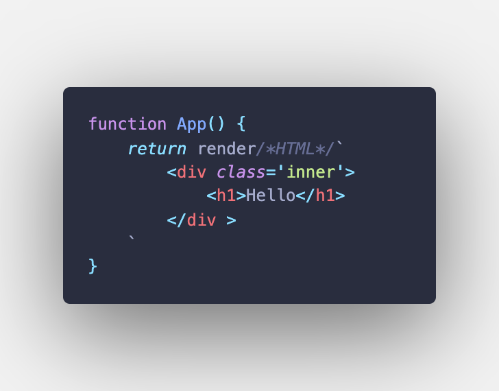

# 使用

## API

### createApp

- 参数：

  - `Function`

- 详细：

传入一个函数，这个函数就是需要渲染的模板函数。你可以在 `createApp` 之后链式调用其它应用 API。

```js
function App() {
	return h`
        <h1>Hello</h1>
    `;
}

createApp(App).mount('#app');
```

#### 应用 API

##### mount

- 参数：

  - `HTMLElement | String`

- 详细：

挂载根组件。所提供 DOM 元素的 innerHTML 将被替换为应用根组件的模板渲染结果。

### h

- 参数：

  - `Function`

- 详细：

` h`` ` 是一个标签函数，标签函数的语法是函数名后面直接带一个模板字符串。比如说，你可以在模板字符串中直接可以写 HTML 标签。

```js
function App() {
	return h`
        <div class='inner'>
            <h1>Hello</h1>
        </div >
    `;
}
```

如果你使用的是 VSCode 编辑器，你可以去商店里下载[es6-string-html](https://marketplace.visualstudio.com/items?itemName=Tobermory.es6-string-html)插件，然后，在` h`` ` 中间加上`/*html*/` 。

就像这样，在 VSCode 编辑器中，这个插件可以使 HTML 模板字符高亮显示。



### setData

- 参数：

  - `Function`
  - `Object`(可选)

- 详细：

第一个参数是一个函数。函数体中需要执行将改变页面状态的值，例如以下示例中的`state.msg`。

```js
const state = {
	msg: '1',
};

function App() {
	return h`
        <button onClick=${useChange}>change</button>
        <p $key>${state.msg}</p>
    `;
}

function useChange() {
	setData(() => {
		state.msg = '2';
	});
}
```

第二个参数是对象类型，可选属性如下：

| 属性   | 作用                                                                                                                   |
| ------ | ---------------------------------------------------------------------------------------------------------------------- |
| status | 标识特殊状态字段，类型为 String。具体属性值可参考[status](/strvejs-doc/zh/usage/#status)                               |
| name   | 函数组件名称，类型为 Function。直接传入一个函数组件，具体使用请参考[命名函数组件](/strvejs-doc/zh/usage/#命名函数组件) |

### emit

- 参数：

  - `String`
  - `Dictionary`
  - `String`

- 详细：

自定义事件，一般是用于子组件数据传入父组件。

第一个参数是表示 `event` 名字的字符串，当在父组件使用时，自定义事件名字前需要加上`on`。

第二个参数一个字典类型参数：

- **detail**：可选的默认值是 `null` 的任意类型数据，是一个与 `event` 相关的值。
- **bubbles**：一个布尔值，表示该事件能否冒泡。 来自 `EventInit`。注意：测试 chrome 默认为不冒泡。
- **cancelable**：一个布尔值，表示该事件是否可以取消。

第三个参数是一个字符串类型，主要是节点选择器的名称，这里的节点指的是子组件在父组件中外层包裹的 DOM 节点。

例如：

```js
// Son
function Component1() {
	return h`
        <h1 onClick=${emitData}>Son</h1>
    `;
}

function emitData() {
	emit(
		'getTit',
		{
			detail: { title: 'This is title!' },
		},
		'.component1'
	);
}

// Father
function App() {
	return h`
        <div onGetTit=${useGetTit} class="component1">
            ${Component1()}   
        </div>
    `;
}

function useGetTit(event) {
	setData(() => {
		console.log(event.detail.title); // This is title!
	});
}
```

### version

- 详细：

无参数，直接获取 Strve.js 的版本号。

### watchDom

- 参数：

  - `String`
  - `Object`
  - `Function`

- 详细：

具有监视对 DOM 树所做更改的能力。第一个参数是字符串类型，是用于监听的节点名称；第二个参数是一个配置对象，具体配置同[MutationObserver](https://developer.mozilla.org/en-US/docs/Web/API/MutationObserver)；第三个参数则是一个回调函数。

另外还提供了两个方法，分别是开启监听方法`start()`与停止监听方法`stop()`。

```js
const config = {
	attributes: true,
	childList: true,
	subtree: true,
	childList: true,
	characterDataOldValue: true,
	characterData: true,
};

const domChange = watchDOMChange('.watch-dom', config, (v) =>
	console.log(v, 'changed')
);

domChange.start();
domChange.stop();
```

### clone

- 参数：

  - `Object`

- 详细：

创建一个新的对象，来接受要重新复制或引用的对象值。

将原对象从内存中完整地拷贝出来一份给新对象，并从堆内存中开辟一个全新的空间存放新对象，且新对象的修改并不会改变原对象，二者实现真正的分离。

```js
const sourceData = {
	msg: 'App',
};

let state = clone(sourceData);

function App() {
	return h`
        <button onClick=${useChange}>Change</button>
        <p $key>${state.msg}</p>
    `;
}

function useChange() {
	setData(() => {
		state.msg = 'Hello';
	});
}
```

## 数据绑定

Strve.js 使用了基于 JavaScript 的模板字符串语法，允许开发者声明式地将 DOM 绑定至底层实例的数据。所有 Strve.js 的模板字符串都是合法的 HTML，所以能被遵循规范的浏览器和 HTML 解析器解析。

在底层的实现上，Strve.js 将模板字符串编译成虚拟 DOM 渲染函数，并把 DOM 操作次数减到最少。

在 Strve.js 中，你可以尽情的使用 JavaScript 的模板字符串，感受它独特的魅力吧！

### 文本

数据绑定中文本绑定的形式就是使用符号`${}`。

```js
const state = {
	msg: 'Hello',
};

function App() {
	return h`
       <h1 $key>${state.msg}</h1>
    `;
}
```

<p class="codepen" data-height="300" data-theme-id="dark" data-default-tab="html,result" data-slug-hash="podPpXZ" data-preview="true" data-editable="true" data-user="maomincoding" style="height: 300px; box-sizing: border-box; display: flex; align-items: center; justify-content: center; border: 2px solid; margin: 1em 0; padding: 1em;">
  <span>See the Pen <a href="https://codepen.io/maomincoding/pen/podPpXZ">
  Strve.js-数据绑定(文本)</a> by Vam (<a href="https://codepen.io/maomincoding">@maomincoding</a>)
  on <a href="https://codepen.io">CodePen</a>.</span>
</p>
<component :is="'script'" async src="https://cpwebassets.codepen.io/assets/embed/ei.js"></component>

### 表达式

在符号`${}`中使用表达式。

```js
const state = {
	a: 1,
	b: 2,
};

function App() {
	return h`
        <h1 $key>${state.a + state.b}</h1>
    `;
}
```

<p class="codepen" data-height="300" data-theme-id="dark" data-default-tab="html,result" data-slug-hash="MWOmMRJ" data-preview="true" data-editable="true" data-user="maomincoding" style="height: 300px; box-sizing: border-box; display: flex; align-items: center; justify-content: center; border: 2px solid; margin: 1em 0; padding: 1em;">
  <span>See the Pen <a href="https://codepen.io/maomincoding/pen/MWOmMRJ">
  Strve.js-数据绑定(表达式)</a> by Vam (<a href="https://codepen.io/maomincoding">@maomincoding</a>)
  on <a href="https://codepen.io">CodePen</a>.</span>
</p>
<component :is="'script'" async src="https://cpwebassets.codepen.io/assets/embed/ei.js"></component>

## 属性绑定

使用符号`${}`可以与属性`value`绑定值。

```js
const state = {
	msg: 'Hello',
};

function App() {
	return h`
        <input type="text" value=${state.msg} $key/>
    `;
}
```

<p class="codepen" data-height="300" data-theme-id="dark" data-default-tab="html,result" data-slug-hash="JjOLjKa" data-preview="true" data-editable="true" data-user="maomincoding" style="height: 300px; box-sizing: border-box; display: flex; align-items: center; justify-content: center; border: 2px solid; margin: 1em 0; padding: 1em;">
  <span>See the Pen <a href="https://codepen.io/maomincoding/pen/JjOLjKa">
  Strve.js-属性绑定(value)</a> by Vam (<a href="https://codepen.io/maomincoding">@maomincoding</a>)
  on <a href="https://codepen.io">CodePen</a>.</span>
</p>
<component :is="'script'" async src="https://cpwebassets.codepen.io/assets/embed/ei.js"></component>

另外，你还可以绑定其他属性，例如`class`。

```js
const state = {
	isRed: true,
	msg: 'Hello',
};

function App() {
	return h`
        <h1 class=${state.isRed ? 'red' : ''} $key>${state.msg}</h1>
    `;
}
```

<p class="codepen" data-height="300" data-theme-id="dark" data-default-tab="html,result" data-slug-hash="mdqxdRb" data-preview="true" data-editable="true" data-user="maomincoding" style="height: 300px; box-sizing: border-box; display: flex; align-items: center; justify-content: center; border: 2px solid; margin: 1em 0; padding: 1em;">
  <span>See the Pen <a href="https://codepen.io/maomincoding/pen/mdqxdRb">
  Strve.js-属性绑定(class)</a> by Vam (<a href="https://codepen.io/maomincoding">@maomincoding</a>)
  on <a href="https://codepen.io">CodePen</a>.</span>
</p>
<component :is="'script'" async src="https://cpwebassets.codepen.io/assets/embed/ei.js"></component>

如果你想绑定`style`属性，同样也可以。

```js
const state = {
	msg: 'Hello',
	style: {
		color: 'red',
		fontSize: '40px',
	},
};

function App() {
	return h`
        <p style="${state.style}">${state.msg}</p>
    `;
}
```

<p class="codepen" data-height="300" data-theme-id="dark" data-default-tab="html,result" data-slug-hash="MWOVWoO" data-preview="true" data-editable="true" data-user="maomincoding" style="height: 300px; box-sizing: border-box; display: flex; align-items: center; justify-content: center; border: 2px solid; margin: 1em 0; padding: 1em;">
  <span>See the Pen <a href="https://codepen.io/maomincoding/pen/MWOVWoO">
  Strve.js-属性绑定(style)</a> by Vam (<a href="https://codepen.io/maomincoding">@maomincoding</a>)
  on <a href="https://codepen.io">CodePen</a>.</span>
</p>
<component :is="'script'" async src="https://cpwebassets.codepen.io/assets/embed/ei.js"></component>

## 条件渲染

使用符号`${}`，这块内容只会在指令的表达式返回 `true` 值的时候被渲染。

```js
const state = {
	isShow: true,
};

function App() {
	return h`
        <button onClick=${useShow}>show</button>
        <div $key>
             ${state.isShow ? h`<p $key>Strve.js</p>` : h`<null $key></null>`}
        </div>
    `;
}

function useShow() {
	setData(() => {
		state.isShow = !state.isShow;
	});
}
```

<p class="codepen" data-height="300" data-theme-id="dark" data-default-tab="html,result" data-slug-hash="dyZmyzE" data-preview="true" data-editable="true" data-user="maomincoding" style="height: 300px; box-sizing: border-box; display: flex; align-items: center; justify-content: center; border: 2px solid; margin: 1em 0; padding: 1em;">
  <span>See the Pen <a href="https://codepen.io/maomincoding/pen/dyZmyzE">
  Strve.js-条件渲染</a> by Vam (<a href="https://codepen.io/maomincoding">@maomincoding</a>)
  on <a href="https://codepen.io">CodePen</a>.</span>
</p>
<component :is="'script'" async src="https://cpwebassets.codepen.io/assets/embed/ei.js"></component>

## 列表渲染

我们可以用符号`${}`基于一个数组来渲染一个列表。比如我们使用数组的`map`方法来渲染列表，并且可以动态添加数组项。

```js
const state = {
	arr: [1, 2],
};

function App() {
	return h`
        <button onClick=${usePush}>push</button>
        <ul $key>
          ${state.arr.map((todo) => h`<li>${todo}</li>`)}
        </ul>
    `;
}

function usePush() {
	setData(() => {
		state.arr.push(3);
	});
}
```

<p class="codepen" data-height="300" data-theme-id="dark" data-default-tab="html,result" data-slug-hash="NWwYWYp" data-preview="true" data-editable="true" data-user="maomincoding" style="height: 300px; box-sizing: border-box; display: flex; align-items: center; justify-content: center; border: 2px solid; margin: 1em 0; padding: 1em;">
  <span>See the Pen <a href="https://codepen.io/maomincoding/pen/NWwYWYp">
  Strve.js-列表渲染</a> by Vam (<a href="https://codepen.io/maomincoding">@maomincoding</a>)
  on <a href="https://codepen.io">CodePen</a>.</span>
</p>
<component :is="'script'" async src="https://cpwebassets.codepen.io/assets/embed/ei.js"></component>

在使用列表渲染页面时，如果在列表头部插入数据则需要传入`useFirstKey`值，以避免`DOM`节点重复渲染，这是必须要做的。

任何在列表头部操作的动作，如`unshift`、`pop`数组方法都需要加上这个`useFirstKey`值。其他操作则不需要这样，内部已经进行了优化。

```js
const state = {
	arr: [1, 2],
};

function Home() {
	return render`
        <button onClick=${useUnshift}>unshift</button>
        <ul $key>
            ${state.arr.map((item) => render`<li>${item}</li>`)}
        </ul>
    `;
}

function useUnshift() {
	updateView(
		() => {
			state.arr.unshift('2');
		},
		{
			status: 'useFirstKey',
		}
	);
}
```

## 事件处理

我们可以使用`on`指令来监听 DOM 事件，并在触发事件时执行一些 JavaScript。我们推荐使用这种`onClick`驼峰式命名方法。

另外，需要使用符号`${}`来绑定事件。

```js
const state = {
	msg: 'sayHello',
};

function App() {
	return h`
        <button onClick=${useClick}>${state.msg}</button>
    `;
}

function useClick() {
	alert('hello');
}
```

<p class="codepen" data-height="300" data-theme-id="dark" data-default-tab="html,result" data-slug-hash="dyZmyex" data-preview="true" data-editable="true" data-user="maomincoding" style="height: 300px; box-sizing: border-box; display: flex; align-items: center; justify-content: center; border: 2px solid; margin: 1em 0; padding: 1em;">
  <span>See the Pen <a href="https://codepen.io/maomincoding/pen/dyZmyex">
  Strve.js-事件处理</a> by Vam (<a href="https://codepen.io/maomincoding">@maomincoding</a>)
  on <a href="https://codepen.io">CodePen</a>.</span>
</p>
<component :is="'script'" async src="https://cpwebassets.codepen.io/assets/embed/ei.js"></component>

## status

### useFirstKey

在当你使用列表渲染时，在列表头部插入数据需要绑定`useFirstKey`字段，以避免`DOM`节点重复渲染。

```js
const state = {
	arr: [1, 2],
};

function Home() {
	return render`
        <button onClick=${useUnshift}>unshift</button>
        <ul $key>
            ${state.arr.map((item) => render`<li>${item}</li>`)}
        </ul>
    `;
}

function useUnshift() {
	updateView(
		() => {
			state.arr.unshift('2');
		},
		{
			status: 'useFirstKey',
		}
	);
}
```

## 命名函数组件

我们在更新组件数据时，不需要全量对比（比如下面的 h2、p 标签，它们不属于 Component1 的内容，就不需要 Diff 对比），只需更新组件内的数据即可。

这时你需要在`setData()`方法中第二个参数传入一个对象，对象键为`name`，值为需要更新的函数组件。另外，你还需要做的事情就是在父组件中需要在函数组件外包裹一层`component`标签，并使用`$name`标记（关于标记请查看[静态标记](/strvejs-doc/zh/usage/#静态标记)），值为函数组件的名称。

```js
const state1 = {
	count: 0,
};

function Component1() {
	return h`
        <h1>Component1</h1>
        <h1 $key>${state1.count}</h1>
        <button onClick=${add1}>add1</button> 
        `;
}

function App() {
	return h`
        <h2>txt1</h2>
        <div>
            <p>txt2</p>
            <component $name="Component1">
                ${Component1()}
            </component>
        </div>
        `;
}

function add1() {
	setData(
		() => {
			state1.count++;
		},
		{
			name: Component1,
		}
	);
}
```

## 静态标记

### $key

当我们更改数据时，内部会进行 Diff 对比，找出不同之处，然后页面会相应的更新。但是，一些不需要更新的节点，比如下面的 button、h1 标签，则不需要对比。只有 p 标签这种动态数据节点需要更新，那么我们显式地在标签上加上静态标记`$key`。

```js
const state = {
	count: 0,
};

function App() {
	return h`
        <button onClick=${add}>add</button>
        <p $key>${state.count}</p>
        <h1>Hello Strve.js</h1>
`;
}

function add() {
	setData(() => {
		state.count++;
	});
}
```

另外，除了在动态数据节点上加上标记外，你还需要注意在一些特殊场景中加上，比如动态添加节点与动态显示、隐藏节点，都需要添加`$key`标记。因为，只有带有`$key`标记的节点才会有被操作 自身 DOM 的能力。

### $name

此标记需要在内置标签 `component` 上使用，标明内部的组件名称，必须与函数组件名相同。

```js
const state1 = {
	count: 0,
};

function Component1() {
	return h`
        <h1 $key>${state1.count}</h1>
        <button onClick=${add1}>add1</button> 
        `;
}

function App() {
	return h`
        <component $name="Component1">
            ${Component1()}
        </component>
        `;
}

function add1() {
	setData(
		() => {
			state1.count++;
		},
		{
			name: Component1,
		}
	);
}
```

## 内置标签

### component

组件标签，标签内包裹函数组件。

```js
function Component1() {
	return h`
        <h1>Hello</h1>
        `;
}

function App() {
	return h`
        <component $name="Component1">
            ${Component1()}
        </component>
        `;
}
```

### null

空标签。可以理解为占位符标签，不会被渲染到页面中。

一般用于条件渲染。

```js
const state = {
	isShow: true,
};

function App() {
	return h`
        <button onClick=${useShow}>show</button>
        <div $key>
             ${state.isShow ? h`<p $key>Strve.js</p>` : h`<null $key></null>`}
        </div>
    `;
}

function useShow() {
	setData(() => {
		state.isShow = !state.isShow;
	});
}
```
